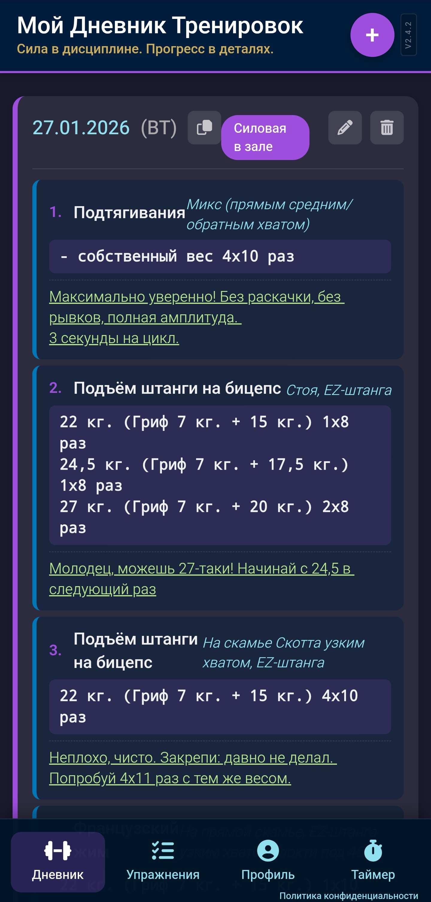
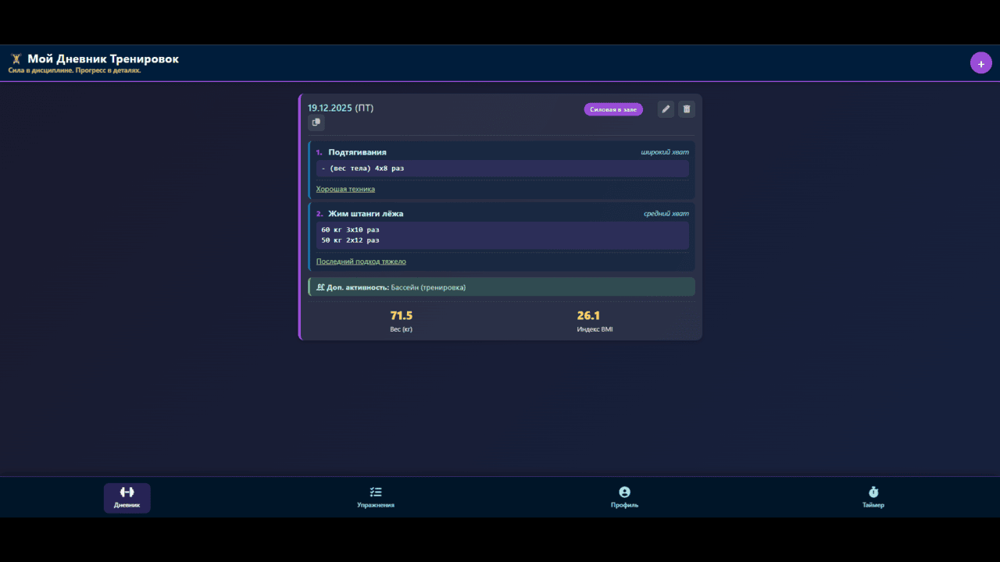

# 🏋️ Мой Дневник Тренировок

**Действующее приложение:** [https://aim2204-pixel.github.io/workout-diary/](https://aim2204-pixel.github.io/workout-diary/)

## 📱 О приложении
Персональный дневник для отслеживания тренировок, контроля веса и анализа прогресса. Создавайте тренировки, записывайте упражнения с подходами, отслеживайте динамику веса и улучшайте свои результаты.

## ✨ Возможности
- 📋 **Дневник тренировок** с карточками по датам
- 🏋️ **База упражнений** — добавляйте свои упражнения
- 📊 **График веса** с фильтрацией по периодам (30 дней, 3 месяца, год, всё время)
- 🎯 **Индекс массы тела (BMI)** — автоматический расчёт
- ⏱️ **Секундомер** с кругами для интервальных тренировок
- 🎨 **3 темы оформления** (тёмная, светлая, премиум)
- 📤 **Экспорт/импорт** данных в JSON (резервное копирование)
- 📝 **Текстовые отчёты** за выбранный период
- 📱 **PWA** — работает офлайн, можно установить на телефон

## 📸 Скриншоты

| Мобильная версия | Десктопная версия |
|------------------|-------------------|
|  |  |

## 🚀 Установка на телефон
1. Откройте ссылку в Chrome на Android
2. Нажмите меню (три точки) → "Добавить на главный экран"
3. Готово! Приложение открывается как родное

## 🎯 Для кого это приложение
- Для тех, кто ведёт дневник тренировок
- Для отслеживания прогресса в зале
- Для контроля веса и BMI
- Для интервальных тренировок (секундомер с кругами)

## 🛠️ Технологии
- Чистый HTML, CSS, JavaScript (без фреймворков)
- **Chart.js** для графиков
- **Font Awesome 6** для иконок
- LocalStorage для хранения данных
- Service Worker для офлайн-работы
- Адаптивный дизайн (мобильные/планшеты/десктопы)

## 📁 Структура проекта